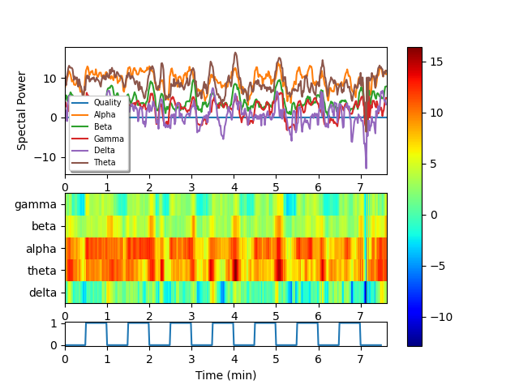

# Brainwave-Analyzer
## Introduction
A simple parser in Python to visualize the brainwave data collected from [NeuroSky Mindwave Mobile EEG Headset](http://neurosky.com/biosensors/eeg-sensor/biosensors/). This was originally develped as part of trying to explore whether it possible to  quantify the calmness induced by different music stimulus through brainwaves - Delta, Theta, Alpha, Beta and Gamma. The visualizer and spectogram plotter may be useful in other domains as well.

Brainwave spectral power logs from NeuroSky Mindwave SDK are exported to a file first and analyzed through teh parser provided here. An example spectral power log and parser are provided.

# Usage
```
python brainview.py <bwave-power-log>
```
# Plot

